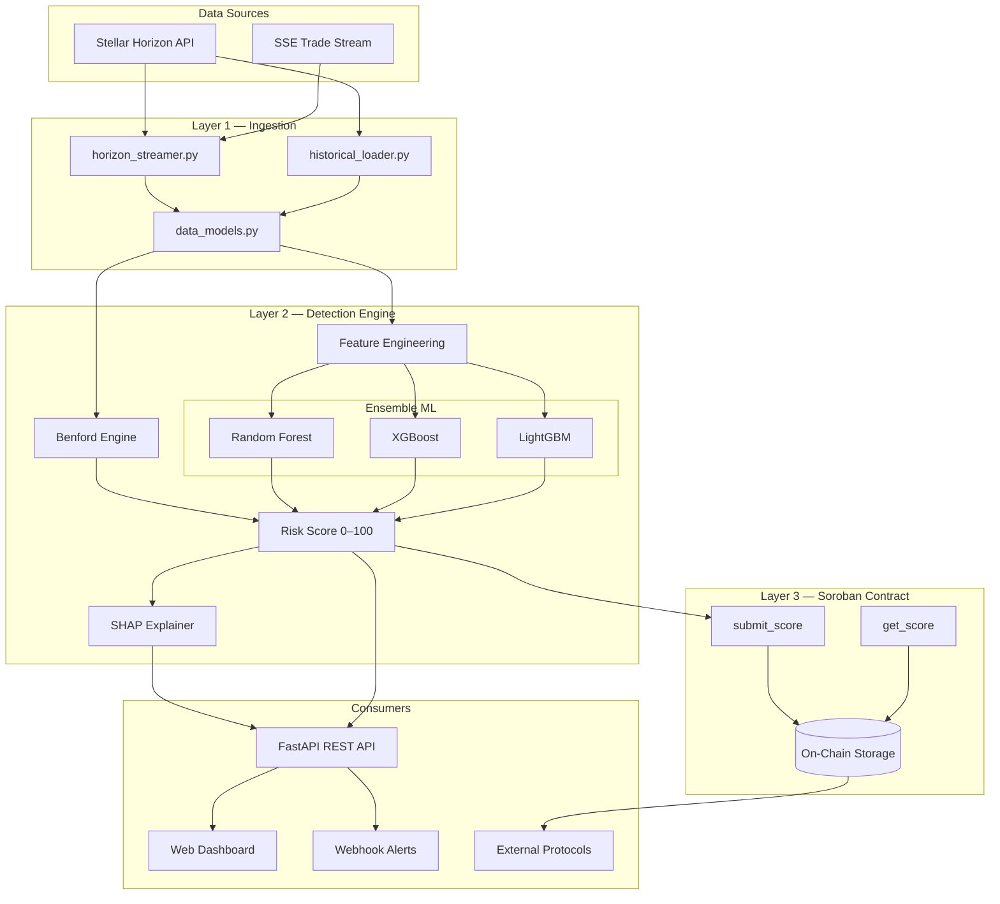
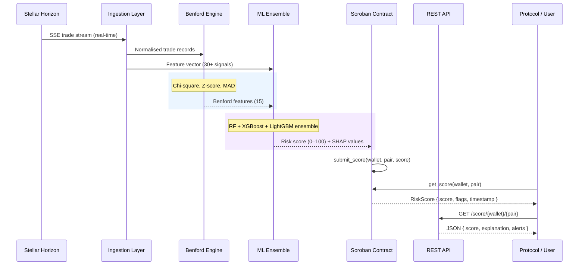

# LedgerLens

[](https://stellar.org)
[](https://soroban.stellar.org)
[](https://python.org)
[](https://fastapi.tiangolo.com)
[](LICENSE)
[](https://dripwave.stellar.org)

> *"On a transparent ledger, every transaction is visible. LedgerLens makes them legible."*

Hybrid on-chain fraud detection for the Stellar DEX — detecting wash trading and artificial volume using **Benford's Law** + **Ensemble Machine Learning** on **Soroban**.

---

## Table of Contents

1. [Overview](#1-overview)
2. [The Problem](#2-the-problem)
3. [Features](#3-features)
4. [Architecture](#4-architecture)
5. [How It Works](#5-how-it-works)
6. [Benford's Law Engine](#6-benfords-law-engine)
7. [Machine Learning Layer](#7-machine-learning-layer)
8. [Soroban Smart Contract](#8-soroban-smart-contract)
9. [Repository Structure](#9-repository-structure)
10. [Quick Start](#10-quick-start)
11. [API Reference](#11-api-reference)
12. [Configuration](#12-configuration)
13. [Testing](#13-testing)
14. [Roadmap](#14-roadmap)
15. [Why This Matters](#15-why-this-matters)
16. [Contributing](#16-contributing)
17. [References](#17-references)

---

## 1. Overview

LedgerLens is a hybrid fraud detection system that identifies wash trading and artificial volume on the Stellar Decentralised Exchange (SDEX). It combines statistical analysis (Benford's Law) with ensemble machine learning to produce a **LedgerLens Risk Score (0–100)** for every wallet and trading pair on the SDEX.

Risk scores are registered on-chain via a Soroban smart contract, making them natively composable with other Stellar protocols — AMMs, lending platforms, and DEX aggregators can gate suspicious activity without any off-chain dependency.

---

## 2. The Problem

Wash trading — simultaneously buying and selling the same asset to inflate volume — is one of the most damaging forms of market manipulation in DeFi. On the SDEX, it causes real harm:

- **Traders are misled** into believing an asset has genuine liquidity when it does not
- **Token issuers game rankings** on DEX aggregators by inflating 24-hour volume figures
- **Liquidity providers lose funds** by entering pools dominated by self-dealing activity
- **Ecosystem credibility suffers** — institutional participants, exchanges, and new users are deterred by unreliable volume metrics

Stellar's 3–5 second finality and sub-cent transaction fees make it possible to execute wash trading at enormous scale for near-zero cost. No production-grade, open-source detection system exists for the SDEX. **LedgerLens is built to fill that gap.**

---

## 3. Features

- **Dual Detection Engine**: Benford's Law statistical analysis combined with ensemble ML classifiers (RF, XGBoost, LightGBM)
- **Real-Time Scoring**: Risk scores computed continuously as new ledger data arrives via Stellar Horizon SSE
- **On-Chain Composability**: Soroban smart contract exposes scores to other Stellar protocols natively
- **30+ ML Features**: Trade patterns, wallet graph metrics, volume anomalies, timing signals
- **SHAP Interpretability**: Every risk score comes with human-readable explanations
- **Public REST API**: Rate-limited endpoints for wallets, asset pairs, and recent alerts
- **Web Dashboard**: Visual risk overview for ecosystem participants
- **Webhook Alerts**: Protocol teams notified immediately when assets cross risk thresholds
- **Multi-Window Analysis**: Benford metrics computed over 1h, 4h, 24h, 7d, and 30d rolling windows

---

## 4. Architecture



---

## 5. How It Works

LedgerLens operates as a three-layer pipeline:

```
┌─────────────────────────────────────────────────────────────┐
│                    LAYER 1: DATA INGESTION                  │
│                                                             │
│  Stellar Horizon API → Trade history, order book events,   │
│  account activity, asset metadata, payment paths           │
│  Streamed continuously via SSE or polled per ledger close  │
└──────────────────────────┬──────────────────────────────────┘
                           │
                           ▼
┌─────────────────────────────────────────────────────────────┐
│                  LAYER 2: DETECTION ENGINE                  │
│                                                             │
│  ┌─────────────────────┐   ┌──────────────────────────┐    │
│  │  Benford's Law       │   │  Ensemble ML Models       │   │
│  │  Anomaly Engine      │   │  (RF, XGBoost, LightGBM) │   │
│  │                      │   │                           │   │
│  │  • Chi-square stat   │   │  • 30+ on-chain features  │   │
│  │  • Z-score per digit │   │  • Trained on labelled    │   │
│  │  • MAD score         │   │    wash trade patterns    │   │
│  │  • Per asset, per    │   │  • SHAP interpretability  │   │
│  │    wallet, per pair  │   │  • Continuous retraining  │   │
│  └──────────┬──────────┘   └──────────────┬────────────┘   │
│             │                             │                  │
│             └──────────────┬──────────────┘                 │
│                            ▼                                 │
│               LedgerLens Risk Score (0–100)                 │
└──────────────────────────┬──────────────────────────────────┘
                           │
                           ▼
┌─────────────────────────────────────────────────────────────┐
│               LAYER 3: SOROBAN CONTRACT + API               │
│                                                             │
│  • Risk scores registered on-chain via Soroban contract    │
│  • Public REST API for external integrations               │
│  • Lightweight web dashboard for ecosystem visibility      │
│  • Webhook alerts for protocol teams                       │
└─────────────────────────────────────────────────────────────┘
```

### Detection Pipeline — Sequence



---

## 6. Benford's Law Engine

Benford's Law states that in naturally occurring numerical datasets, the leading digit 1 appears ~30.1% of the time, declining to 4.6% for the digit 9. Genuine organic trading produces this distribution. Wash trading — driven by bots with fixed lot sizes and round-number amounts — violates it systematically.

LedgerLens applies three metrics over rolling time windows for each wallet and trading pair:

| Metric | Formula | Anomaly Threshold |
|--------|----------|-------------------|
| **Chi-square statistic** | `Σ (observed − expected)² / expected` | p < 0.05 |
| **Z-score (per digit)** | `(observed_freq − expected_freq) / std_error` | \|z\| > 1.96 |
| **Mean Absolute Deviation** | `mean(|observed − expected|)` | MAD > 0.015 |

Time windows: **1h · 4h · 24h · 7d · 30d** (15 Benford features total).

These signals are not standalone — Benford alone cannot distinguish high-frequency market makers from wash traders. LedgerLens always combines Benford output with the ML layer.

---

## 7. Machine Learning Layer

### Feature Categories (30+ features)

**Benford Features (15)**
- Chi-square, Z-score, and MAD across 5 rolling time windows per wallet/pair

**Trade Pattern Features**
- Counterparty concentration ratio — fraction of volume with a single counterparty
- Round-trip trade frequency — trades returning assets to origin wallet within N ledgers
- Self-matching rate — correlated buy/sell orders from shared funding sources
- Order cancellation rate and timing distribution

**Volume and Timing Features**
- Volume-to-unique-counterparty ratio
- Intra-minute trade clustering coefficient
- Off-hours activity ratio (trades at statistically unusual ledger times)
- Volume spike frequency relative to rolling baseline

**Wallet Graph Features**
- Funding source similarity score
- Network centrality within trading cluster graphs
- Account age at time of first suspicious activity

### Model Architecture

| Model | Role | Evaluation Metric |
|-------|------|-------------------|
| **Random Forest** | Stable baseline; handles missing features | AUC-ROC, F1 |
| **XGBoost** | Primary classifier; best on tabular on-chain data | Precision-Recall AUC |
| **LightGBM** | High-speed inference for real-time scoring | F1-score |

All models use **SMOTE** oversampling to handle class imbalance. **SHAP values** explain every risk score for end-users and auditors.

---

## 8. Soroban Smart Contract

The Soroban contract is the on-chain truth layer. It stores computed risk scores and exposes them to any other Stellar protocol.

### Contract Functions

#### Write Functions (LedgerLens service only)

- `submit_score(wallet, asset_pair, score, timestamp)` — Register a computed risk score on-chain
- `submit_batch(entries)` — Batch score submission for efficiency

#### Read Functions (public, callable by any contract)

- `get_score(wallet, asset_pair) → RiskScore` — Latest risk score and metadata for a wallet/pair
- `get_flagged_wallets() → Vec<Address>` — List of wallets currently above the alert threshold
- `is_flagged(wallet) → bool` — Simple boolean check for protocol gating
- `health() → HealthStatus` — Contract liveness and last-updated timestamp

#### Admin Functions

- `initialize(admin, service_account, alert_threshold)` — One-time contract setup
- `update_threshold(new_threshold)` — Adjust the score level that triggers on-chain flagging (admin only)
- `rotate_service_account(new_account)` — Update the authorised score-submission account (admin only)

### On-Chain Data Structure

```rust
pub struct RiskScore {
    pub score: u32,         // 0–100; higher = more suspicious
    pub benford_flag: bool, // true if Benford anomaly detected
    pub ml_flag: bool,      // true if ML ensemble flagged
    pub timestamp: u64,     // ledger timestamp of last update
    pub confidence: u32,    // model confidence 0–100
}
```

### Composability Example

Any Soroban contract can gate activity based on LedgerLens scores without off-chain dependencies:

```rust
// Example: AMM preventing liquidity provision from flagged wallets
let risk = ledgerlens_client.get_score(&wallet, &asset_pair);
if risk.score > 75 {
    return Err(ContractError::SuspiciousWallet);
}
```

---

## 9. Repository Structure

```
ledgerlens/
│
├── README.md                         ← This file
├── requirements.txt                  ← Python dependencies
├── run_pipeline.py                   ← Full detection pipeline entry point
├── .env.example                      ← Environment variable template
│
├── ingestion/
│   ├── __init__.py
│   ├── horizon_streamer.py           ← Real-time trade data via Horizon SSE
│   ├── historical_loader.py          ← Bulk historical trade ingestion
│   └── data_models.py               ← Pydantic schemas for trade records
│
├── detection/
│   ├── __init__.py
│   ├── benford_engine.py             ← Benford's Law feature computation
│   ├── feature_engineering.py       ← On-chain ML feature extraction
│   ├── model_training.py            ← Train ensemble classifiers
│   ├── model_inference.py           ← Real-time risk scoring
│   └── shap_explainer.py            ← SHAP interpretability layer
│
├── contracts/
│   ├── ledgerlens-score/            ← Soroban smart contract (Rust)
│   │   ├── src/
│   │   │   ├── lib.rs               ← Contract entry point
│   │   │   ├── types.rs             ← RiskScore and related types
│   │   │   ├── storage.rs           ← Persistent storage helpers
│   │   │   ├── events.rs            ← Event emission
│   │   │   └── errors.rs            ← Custom error types
│   │   └── Cargo.toml
│   └── deploy.sh                    ← Testnet deployment script
│
├── api/
│   ├── main.py                      ← FastAPI application
│   ├── schemas.py                   ← Request / response Pydantic models
│   └── routes/
│       ├── __init__.py
│       ├── scores.py                ← GET /score/{wallet}/{pair}
│       ├── alerts.py                ← GET /alerts/recent
│       └── assets.py               ← GET /assets/risk-ranking
│
├── dashboard/
│   ├── index.html                   ← Web dashboard
│   ├── app.js                       ← Dashboard frontend logic
│   └── styles.css                   ← Dashboard styling
│
└── tests/
    ├── test_benford.py
    ├── test_features.py
    └── test_api.py
```

---

## 10. Quick Start

### Prerequisites

- Python 3.11+
- [Stellar Horizon access](https://developers.stellar.org/api/horizon) (public endpoint or self-hosted)
- [Rust + Soroban CLI](https://soroban.stellar.org/docs/getting-started/setup) (for contract deployment only)

### 1. Clone and Install

```bash
git clone https://github.com/Inkman007/Ledgerlens-dashboard.git
cd Ledgerlens-dashboard
python -m venv .venv
source .venv/bin/activate      # Windows: .venv\Scripts\activate
pip install -r requirements.txt
```

### 2. Configure Environment

```bash
cp .env.example .env
```

Edit `.env` with your settings:

```bash
# Stellar network
HORIZON_URL=https://horizon-testnet.stellar.org
NETWORK=testnet

# Asset pair to monitor (e.g. XLM:native / USDC:GA5Z...)
TARGET_ASSET_CODE=USDC
TARGET_ASSET_ISSUER=GA5ZSEJYB37JRC5AVCIA5MOP4RHTM335X2KGX3IHOJAPP5RE34K4KZVN

# Soroban contract
LEDGERLENS_CONTRACT_ID=your_contract_id_here
SERVICE_ACCOUNT_SECRET=your_signing_key_here

# API server
API_HOST=0.0.0.0
API_PORT=8000
ALERT_THRESHOLD=75
```

### 3. Run the Detection Pipeline

```bash
python run_pipeline.py
```

### 4. Start the API Server

```bash
uvicorn api.main:app --reload
```

API docs available at `http://localhost:8000/docs`.

### 5. Deploy the Soroban Contract (optional)

```bash
cd contracts
chmod +x deploy.sh
./deploy.sh testnet
```

---

## 11. API Reference

### `GET /score/{wallet}/{asset_pair}`

Returns the current LedgerLens risk score for a wallet and trading pair.

**Response**

```json
{
  "wallet": "GCEZWKCA5VLDNRLN3RPRJMRZOX3Z6G5CHCGMJUI6TUOHTFKDMHH0PMJK",
  "asset_pair": "XLM:USDC",
  "score": 82,
  "benford_flag": true,
  "ml_flag": true,
  "confidence": 91,
  "timestamp": 1718500000,
  "explanation": {
    "top_features": [
      { "feature": "counterparty_concentration_ratio", "contribution": 0.34 },
      { "feature": "benford_chi_square_24h", "contribution": 0.27 },
      { "feature": "round_trip_frequency", "contribution": 0.19 }
    ]
  }
}
```

### `GET /alerts/recent`

Returns wallets and pairs flagged in the last 24 hours, ordered by score descending.

**Query params**: `limit` (default 50), `min_score` (default 75)

### `GET /assets/risk-ranking`

Returns all monitored assets ranked by their aggregate risk score.

**Query params**: `limit` (default 100), `window` (`1h` | `24h` | `7d`)

---

## 12. Configuration

All configuration is managed via environment variables. Copy `.env.example` to `.env` and fill in your values.

| Variable | Required | Default | Description |
|----------|----------|---------|-------------|
| `HORIZON_URL` | Yes | — | Stellar Horizon endpoint |
| `NETWORK` | Yes | `testnet` | `testnet` or `mainnet` |
| `TARGET_ASSET_CODE` | No | — | Specific asset to monitor |
| `TARGET_ASSET_ISSUER` | No | — | Issuer of the target asset |
| `LEDGERLENS_CONTRACT_ID` | Yes | — | Deployed Soroban contract address |
| `SERVICE_ACCOUNT_SECRET` | Yes | — | Signing key for score submission |
| `API_HOST` | No | `0.0.0.0` | API bind address |
| `API_PORT` | No | `8000` | API port |
| `ALERT_THRESHOLD` | No | `75` | Score above which a wallet is flagged |
| `ML_MODEL_PATH` | No | `models/` | Path to trained model files |
| `BENFORD_MIN_SAMPLES` | No | `30` | Minimum trades before Benford analysis |
| `LOG_LEVEL` | No | `INFO` | Logging verbosity |

---

## 13. Testing

```bash
# Run all tests
pytest tests/ -v

# Run specific test suites
pytest tests/test_benford.py -v
pytest tests/test_features.py -v
pytest tests/test_api.py -v

# Run with coverage
pytest tests/ --cov=. --cov-report=html
```

Test coverage targets:

- ✅ Benford chi-square, Z-score, and MAD computation
- ✅ Feature extraction against known wash trade patterns
- ✅ API endpoint response schemas
- ✅ Soroban contract: score submission and retrieval
- ✅ Soroban contract: authorization enforcement
- ✅ Edge cases: insufficient data, single counterparty, zero-volume pairs

---

## 14. Roadmap

### Phase 1 — Foundation *(Months 1–2)*
- [x] Project scaffolding and repository structure
- [x] Pydantic data models for trade records
- [x] Stellar Horizon SSE ingestion pipeline
- [x] Benford's Law engine (chi-square, Z-score, MAD)
- [x] Soroban smart contract (submit/get score, authorization)
- [ ] Baseline ML feature engineering
- [ ] Initial model training on historical SDEX data

### Phase 2 — Core Product *(Months 3–4)*
- [ ] Full ensemble model training and evaluation
- [ ] SHAP interpretability integration
- [ ] Soroban contract deployment on Testnet
- [ ] Public REST API (v1) with rate limiting
- [ ] Web dashboard (beta)

### Phase 3 — Ecosystem Integration *(Months 5–6)*
- [ ] Mainnet deployment
- [ ] SDK for protocol integrations (Python + JavaScript)
- [ ] Webhook alert system for asset issuers and protocol teams
- [ ] Open dataset release: labelled SDEX wash trade patterns
- [ ] Community feedback and model refinement cycle

### Phase 4 — Scale *(Post-Grant)*
- [ ] Continuous model retraining pipeline
- [ ] Coverage expansion to AMM pools and cross-asset paths
- [ ] Integration partnerships with Stellar DEX aggregators
- [ ] Developer documentation portal

---

## 15. Why This Matters

Stellar's growth as a platform for real-world asset tokenisation, remittances, and DeFi depends on the credibility of its markets. A DEX where volume figures cannot be trusted will deter institutional participants, regulated entities, and serious retail traders.

**For traders** — Know which assets have genuine liquidity before placing orders. The risk score dashboard provides instant, interpretable signals without requiring on-chain expertise.

**For asset issuers** — Demonstrate that your token's volume is organic. A low LedgerLens risk score is a credibility signal for listings, investor materials, and community communications.

**For protocol teams** — Integrate LedgerLens scores into AMM and lending contract logic to automatically protect users from wash-traded assets or flagged wallets — with no off-chain dependency.

**For the Stellar ecosystem** — An open, verifiable, community-maintained fraud detection layer strengthens Stellar's case as credible financial infrastructure.

LedgerLens is not a surveillance tool. It is an **open-source public good** — scores, methodology, and training data are fully transparent and auditable. In keeping with Stellar's mission of open financial infrastructure, LedgerLens will always be free to query and open to community contribution.

---

## 16. Contributing

Contributions are welcome. We are actively looking for collaborators with experience in:

- Stellar / Soroban smart contract development (Rust)
- Python backend and ML pipeline engineering
- On-chain data analysis and blockchain forensics
- Frontend development (dashboard)
- DeFi protocol integration

### Process

1. Fork the repository
2. Create a feature branch: `git checkout -b feat/your-feature`
3. Ensure all tests pass: `pytest tests/ -v`
4. Submit a pull request with a clear description of what changed and why

Please open an issue before starting significant work so we can align on approach.

### Contact

- GitHub Issues: [Create an issue](https://github.com/Inkman007/Ledgerlens-dashboard/issues)
- Stellar Discord: Find us in `#builders`
- Email: [victoruzoma874@gmail.com](mailto:victoruzoma874@gmail.com)

---

## 17. References

- Benford, F. (1938) 'The law of anomalous numbers', *Proceedings of the American Philosophical Society*, 78(4), pp. 551–572.
- Al Ali, A. et al. (2023) 'A powerful predicting model for financial statement fraud based on optimized XGBoost ensemble learning technique', *Applied Sciences*, 13(4).
- Nti, I.K. and Somanathan, A.R. (2024) 'A scalable RF-XGBoost framework for financial fraud mitigation', *IEEE Transactions on Computational Social Systems*, 11(2), pp. 410–422.
- Yadavalli, R. and Polisetti, R. (2025) 'Optimized financial fraud detection using SMOTE-enhanced ensemble learning with CatBoost and LightGBM', *ICVADV 2025*.
- Harea, R. and Mihailă, S. (2025) 'Benford's law: Applicability in accounting and financial anomaly detection', *Challenges of Accounting for Young Researchers*, 3(1).
- Stellar Development Foundation (2024) *Horizon API Documentation*. [https://developers.stellar.org/api/horizon](https://developers.stellar.org/api/horizon)
- Stellar Development Foundation (2024) *Soroban Smart Contract Documentation*. [https://soroban.stellar.org/docs](https://soroban.stellar.org/docs)

---

<div align="center">

**LedgerLens** — Making the Stellar ledger legible.

*Built for the Stellar ecosystem. Open source. Community owned.*

</div>
